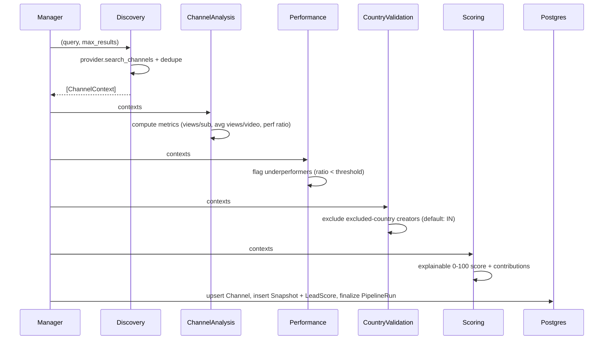
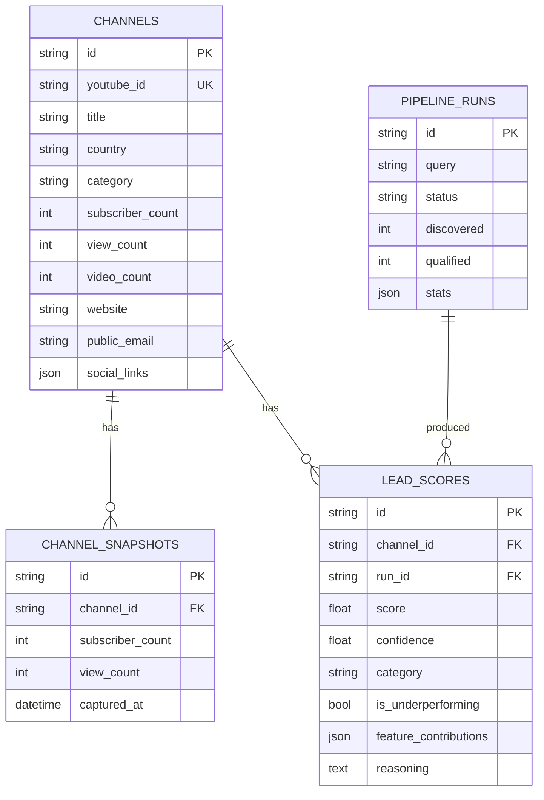

# CIP — Architecture Overview (Phase 1)

This documents the **runnable foundation** in this repo and how it maps onto the
full platform described in the master brief. It follows Clean/Hexagonal
architecture: domain and business logic sit at the center; providers, DB, and
transport are adapters at the edges.

## System context

```mermaid
flowchart LR
  subgraph Client
    UI[Next.js Dashboard]
  end
  subgraph Backend[FastAPI Backend]
    API[REST API v1]
    MGR[Manager Agent]
    AGENTS[Agent Pipeline]
    REPO[Repositories]
  end
  subgraph Async
    CELERY[Celery Worker]
    REDIS[(Redis)]
  end
  subgraph Data
    PG[(PostgreSQL)]
  end
  subgraph External
    YT[YouTube Provider\nmock | Data API v3]
  end

  UI -->|HTTP JSON| API
  API --> MGR
  API -->|enqueue| REDIS --> CELERY --> MGR
  MGR --> AGENTS --> YT
  MGR --> REPO --> PG
  API --> REPO
```

## Agent pipeline (implemented)



Each agent (`app/agents/*`) has typed input/output, a structured logger,
bounded retries, and is idempotent. The pure business logic lives in
`app/agents/metrics.py` and is unit-tested in isolation.

### Agents in this phase
| Agent | Responsibility | Status |
|-------|----------------|--------|
| Manager | Orchestrate + persist + audit | ✅ |
| Discovery | Query provider, normalize, dedupe | ✅ |
| Channel Analysis | Derive per-channel metrics | ✅ |
| Performance Analysis | Underperformance detection | ✅ |
| Country Validation | Exclude excluded countries | ✅ |
| Opportunity Scoring | Explainable lead score | ✅ |
| Public Contact Enrichment | Public business info | 🔜 Phase 2 (mock provides sample data) |
| AI Insight / Email Personalization | LLM outputs | 🔜 Phase 2 |
| CRM Sync / Notification / Report / QA / Scheduler | Ops agents | 🔜 Phase 2+ |

## Data model (ER)



## Scoring model

Explainable weighted score in `metrics.score_lead`:

| Feature | Weight | Signal |
|---------|--------|--------|
| opportunity_gap | 0.40 | How far below the healthy views/subscriber baseline |
| audience_size | 0.25 | log-scaled subscriber count |
| reachability | 0.20 | public email / website / socials available |
| content_volume | 0.15 | number of videos (activity) |

Output: `score` (0–100), `confidence` (0–1), `category`
(hot ≥70 / warm ≥45 / cold ≥25 / disqualified), and per-feature
`contribution` values that sum to the score (verified by test).

## API surface (v1)

| Method | Path | Purpose |
|--------|------|---------|
| POST | `/api/v1/pipeline/run` | Run discovery→scoring (inline or `run_async` via Celery) |
| GET | `/api/v1/pipeline/runs` | List recent runs |
| GET | `/api/v1/pipeline/runs/{id}` | Run detail |
| GET | `/api/v1/leads` | Scored leads (filter by `category`) |
| GET | `/api/v1/leads/{id}` | Channel detail |
| GET | `/api/v1/overview` | Dashboard KPIs |
| GET | `/health` | Liveness |

## Key design decisions (ADR-style summary)

- **Real YouTube Data API v3 by default** behind a `YouTubeProvider` port
  (`integrations/youtube/`): `api.py` implements channel search, channel details,
  recent videos, and video statistics with pagination, batched id lookups,
  retry/backoff (`errors.py`), response caching (`cache.py` — Redis or in-memory),
  client-side rate limiting (`ratelimit.py`), and a daily quota budget
  (`quota.py`, persisted to `api_quota_usage`, exposed at `GET /api/v1/quota`).
  The mock provider is a labelled **test double** only, so the suite never hits
  the live, quota-limited API.
- **Pure metric/scoring core**: business rules are I/O-free functions → fast,
  deterministic unit tests and reuse across agents.
- **Async SQLAlchemy 2.0 + Alembic**: production Postgres; SQLite (StaticPool,
  in-memory) for tests — same code path, no external services in CI.
- **Idempotent upsert by `youtube_id`**: re-running discovery updates channels
  instead of duplicating (safe for incremental/scheduled runs).
- **Manager owns the transaction + audit** (`PipelineRun`): every run is
  traceable with summary stats and error capture.
- **Celery bridge via `asyncio.run`**: reuses the exact async Manager path in
  the worker; no duplicated logic between sync and async execution.

## Compliance

- Collects **only publicly available information**. The enrichment agent (Phase 2)
  must draw from public sources only and honor robots directives.
- Respect **YouTube ToS** and Data API quota (search.list = 100 units/call).
- Country exclusion (default `IN`) is enforced by the Country Validation agent
  and configurable via `EXCLUDED_COUNTRIES`.
- Handle personal data under GDPR/CCPA: store only what's necessary, support
  deletion, and keep the audit trail (`PipelineRun`, snapshots).

See `ROADMAP.md` for what Phase 2+ adds.
